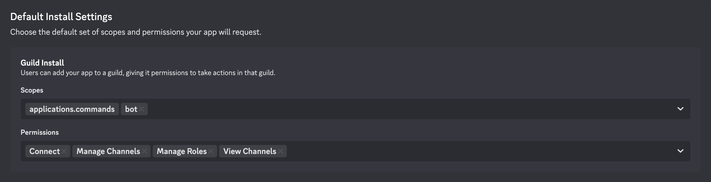

# Self Hosting Guide:

A Docker image is provided for self hosting purposes. It has all the same features as the main bot (that we host), but can be run anywhere, including your own laptop! The only requirement is that you have Docker, and an internet connection available.

**Note:** The Docker image is made for small server loads. Attempting to monitor > 100 servers may cause unwanted behaviour. Use of the bot in more than 10 Discord Servers is not supported. Use of docker images for commercial purposes is prohibited.

## Hosting options

You may choose to host the bot on your own hardware, or a cloud provider. We have developed a one-click-to-deploy template that will deploy an instance of the bot to the cloud by simply clicking the button below. Whichever route you choose, you will have access to all the same features.

[](https://railway.com/deploy/mcstatusbot?referralCode=eM55xc&utm_medium=integration&utm_source=template&utm_campaign=generic)

Here is a small table comparing hosting options:

| On cloud                                                                                               | On your own server                                                                                          |
| ------------------------------------------------------------------------------------------------------ | ----------------------------------------------------------------------------------------------------------- |
| 🟢 Automatic updates by default                                                                        | 🟡 Automatic updates must be manually configured                                                            |
| 🟢 Tested working configuration                                                                        | 🟡 Images are tested, but overall configuration depends on your system setup                                |
| 🔴 Monitoring of private IP addresses is not allowed. Your Minecraft server must be publicly acessible | 🟢 Monitoring private IP addresses allowed. You do not need to expose your minecraft server to the internet |
| 🟡 Paid (monthly subscription)                                                                         | 🟢 Free! (use your own hardware)                                                                            |

## General Requirements

The following is required to run an instance of the bot:

- A Discord bot client ID and token.
- A computer with Docker installed (>1 CPU, >2GB RAM)
- An internet connection

Hosting the bot on your own hardware requires basic knowledge of the operation and maintenance of Docker containers, and the management of Discord bots via the Developer Portal. If you feel uncomfortable with either of these, we recommend you use the centrally hosted version instead, using this [invite link](https://discord.com/api/oauth2/authorize?client_id=788083161296273517&permissions=269485072&scope=bot%20applications.commands).

**Note:** While you may run the bot on any computer, it is recommended to run it on a small server that is available 24x7. Running it on a laptop might require some additional considerations (see below)

## Creating the Discord Bot

We must first register a bot with Discord. Begin [here](https://discord.com/developers/applications?new_application=true)

1. Give your bot a name.
2. Copy the Client ID and Bot Token.
3. Ensure the bot has correct permissions (see below).
4. Use the Discord provided invite link to invite your bot to your server.



## Docker compose

Use the following docker compose file to start a basic instance of the bot:

```
name: "mcstatusbot"

services:
  mongodb:
    image: mongo:latest
    volumes:
      - mcstatusbot-data:/data/db

  redis:
    image: redis:latest

  mcpingserver:
    image: rar1871/mcpingserver:latest
    depends_on:
      - redis

  mcstatusbot:
    image: rar1871/mcstatusbot:latest
    environment:
      - CLIENT_ID=<YOUR_BOT_CLIENT_ID>
      - TOKEN=<YOUR_BOT_TOKEN>
    depends_on:
      - mcpingserver
      - mongodb

volumes:
  mcstatusbot-data:
```

## Additional options:

The `mcstatusbot` service accepts the following additional options, defined as environment variables.

**Note:** All booleans are lower case.

| Name                        | Description                                                                                                                                                                                                                                     | Default                    |
| --------------------------- | ----------------------------------------------------------------------------------------------------------------------------------------------------------------------------------------------------------------------------------------------- | -------------------------- |
| `UPDATE_SERVERS_ON_LAUNCH ` | This option will force the bot to refresh server statuses for monitored servers on launch. Use carefully, as if your bot restarts often, you might hit Discord rate limits                                                                      | `false`                    |
| `DATABASE_URL`              | If you do not wish to use the MongoDB service included by default, you may provide a custom URL here                                                                                                                                            | `mongodb://mongodb:27107`  |
| `DATABASE_NAME`             | Provide a custom database name here. This has no meaningful effect if not using a custom MongoDB instance                                                                                                                                       | `mcstatusbot`              |
| `ALLOW_PRIVATE_IPS`         | Allow the bot to check private IP addresses such as `localhost` or `192.168.x.y`. WARNING! If you are hosting on a commercial hosting provider, you may get banned!                                                                             | `false`                    |
| `CACHE_SM`                  | Define the cache value in seconds for the `/status` command. Setting a value lower than the default may get your ip address banned from some servers! Setting too high a value might cause stale responses                                      | `60`                       |
| `CACHE_LG`                  | Define the cache value in seconds for the periodic voice channel update. Setting a value lower than the default may get your ip address banned from some servers! Setting too high a value may cause an incorrect server status to be displayed | `360`                      |
| `PING_URL`                  | The full IP address (including http://) or FQDN for the `mcpingserver` service. Useful if you want to run the ping server on a different machine, but in most cases we recommend leaving the defaults.                                          | `http://mcpingserver:8000` |

The `mcpingserver` service accepts the following additional options, defined as environment variables.

| Name        | Description                                                                                        | Default                |
| ----------- | -------------------------------------------------------------------------------------------------- | ---------------------- |
| `REDIS_URL` | If you do not wish to use the Redis service included by default, you may provide a custom URL here | `redis://redis:6379/0` |

## Additional considerations:

- More RAM is better, especially as you add more servers.
- The bot needs a continuous internet connection. If using a laptop, and the laptop goes to sleep this connection might be interupted. Reconnecting to the Discord gateway will require a bot restart.
- You may use services such as Watchtower to automatically update bot images when new versions are available. This is recommended to keep up to date with latest features and bug fixes
